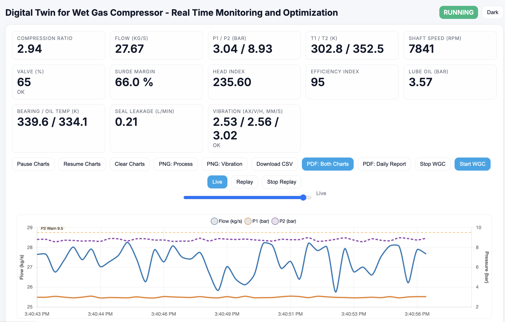

# Digital Twin — Wet Gas Compressor (WGC)
**Real‑time Monitoring & Optimization Demo**

> **Note:** The repository name is historic (`motor-digitaltwin`). The app now demonstrates a **Wet Gas Compressor** digital twin.



> Put a screenshot at **`docs/screenshot.png`** to show it above.

---

## ✨ Features

- **Live telemetry → Real‑time charts** (Chart.js 4)  
  - Process: **Flow**, **P1**, **P2** with thresholds & alarm zones  
  - Mechanical health: **Vibration Ax/Vert/Horz**
- **Compressor map (synthetic)**: speed curves (7000/7800/8500 rpm), **surge line**, **current point**
- **Dark/Light** theme toggle
- **Time scrubber & Replay** (~30 min buffer)
- **Exports**: PNG (per chart), CSV (timeseries), PDF (both charts), **Daily report PDF** (KPIs + alarm counts)
- **Controls**: Start/Stop + setpoints (**Speed**, **Valve**)
- **Quiet logs** by default (no noisy HTTP access lines)

---

## 🧱 Architecture

```
wgc_sim.py  ──(HTTP JSON every 1s)──>  Flask app (/ingest-wgc)
                                      │
                                      └─> Flask-SocketIO → web clients (wgc.html)
                                              ▲
                                   Chart.js + Zoom + Annotation + jsPDF
```

- **Server:** Flask + Flask‑SocketIO (Eventlet runner)  
- **Client:** Chart.js, chartjs-plugin-zoom, chartjs-plugin-annotation, jsPDF  
- **Ingest API:** `POST /ingest-wgc` (JSON). Server broadcasts snapshots on `wgc_data`.  
  UI sends `wgc_command` (`start` / `stop` / `setpoints`) and receives `wgc_ack`.

---

## 🚀 Quick Start (Local)

Requirements: **Python 3.11+**

```bash
git clone https://github.com/appars/motor-digitaltwin.git
cd motor-digitaltwin

python3 -m venv venv
source venv/bin/activate
pip install --upgrade pip

# Install deps
pip install -r requirements.txt  # if present
# or:
pip install flask Flask-SocketIO eventlet requests

# Run server (default port 5050)
python app.py
# open http://localhost:5050/wgc

# In a second terminal: start the simulator (posts data every ~1s)
source venv/bin/activate
python wgc_sim.py
```

**Environment variables (server):**

- `PORT` (default `5050`)
- `LOG_LEVEL` (default `WARNING` → quiet; use `INFO`/`DEBUG` if needed)

**Environment variables (simulator):**

- `TWIN_URL` (default `http://localhost:5050`)
- `SIM_VERBOSE=1` (show progress/errors)
- `SIM_LOG_EVERY=200` (progress line every N samples)
- `SIM_TIMEOUT` (POST timeout, default `3.0` s)

---

## 📡 Ingest API

**POST** `/ingest-wgc`

**Body (JSON):**
```json
{
  "oper": {
    "T1": 303.2, "T2": 352.9,
    "P1": 3.02,  "P2": 8.84,
    "flow": 26.1,
    "speed": 7800,
    "valve": 65
  },
  "health": {
    "v_ax": 2.4, "v_vert": 2.7, "v_horz": 2.9,
    "oil_pressure": 3.6,
    "bearing_temp": 340.5, "oil_temp": 335.2,
    "seal_leak": 0.25
  }
}
```

**Response:**
```json
{"ok": true}
```

**Socket.IO events:**

- Server → Client: `wgc_data` (live snapshots), `wgc_ack` (acknowledgements)  
- Client → Server: `wgc_command`  
  - `{ "action":"start" }`  
  - `{ "action":"stop" }`  
  - `{ "action":"setpoints", "speed": 7800, "valve": 65 }`

---

## 🖥️ UI Cheat‑Sheet

- **KPIs:** Compression ratio, Flow, P1/P2, T1/T2, Speed, Valve, Surge Margin, Head/Efficiency indices, Lube oil pressure, Bearing/Oil temp, Seal leakage, Vibration
- **Controls:** Pause / Resume / Clear charts; Start / Stop; Setpoints sliders
- **Time tools:** **Live**, **Scrub** slider, **Replay** (playback), **Stop Replay**
- **Exports:** PNG (process/vibration), CSV, **PDF: both charts**, **Daily PDF** with KPIs + alarm counts
- **Thresholds** (editable in `templates/wgc.html`):
  - **P2 warn/trip:** 9.5 / 10.5 bar
  - **Vibration warn/trip:** 3.5 / 7.1 mm/s

---

## 📁 Project Structure

```
motor-digitaltwin/
├─ app.py                     # Flask + Socket.IO (quiet by default)
├─ wgc_sim.py                 # Synthetic telemetry generator
├─ templates/
│  └─ wgc.html                # Full UI (charts, controls, exports, dark mode)
├─ static/
│  ├─ favicon.svg
│  └─ vendor/
│     ├─ chartjs-plugin-zoom.umd.min.js
│     └─ chartjs-plugin-annotation.umd.min.js
├─ docs/
│  └─ screenshot.png          # (optional) used in README
├─ requirements.txt           # (optional) pinned deps
└─ README.md
```

> Plugins are served **locally** from `static/vendor/` to avoid CDN hiccups.

---

## 🔧 Customization

- **Thresholds / labels:** edit annotation config in `templates/wgc.html`.
- **Theme & palette:** CSS variables at top of `wgc.html` (`:root` & `html[data-theme="dark"]`).
- **Chart performance:** LTTB decimation on; adjust `samples`, history buffer (`MAX_HIST`), and window (`WIN`) in `wgc.html`.

---

## 🧪 Troubleshooting

- **No data on charts** → run simulator and ensure it points to your server:
  ```bash
  export TWIN_URL=http://127.0.0.1:5050
  python wgc_sim.py
  ```
- **Socket.IO 400 / `io is not defined`** → ensure client lib is loaded in `wgc.html`:
  ```html
  <script src="https://cdn.jsdelivr.net/npm/socket.io-client@4.7.5/dist/socket.io.min.js"></script>
  ```
  and server is Flask‑SocketIO (which serves `/socket.io/`).
- **Port busy** → `lsof -i :5050` and kill, or `export PORT=5051`.
- **Logs too chatty** → default is `LOG_LEVEL=WARNING`; avoid `print()` in code.

---

## 📦 Suggested `requirements.txt`

```txt
Flask>=3.0
Flask-SocketIO>=5.3
python-socketio>=5.11
python-engineio>=4.9
eventlet>=0.36
requests>=2.31
```

Install with:
```bash
pip install -r requirements.txt
```

---

## 🔒 Demo Safety Notes

- This is a **demo**. Thresholds, compressor map, and derived indices are illustrative.
- For production: secure `/ingest-wgc` (authN/Z, rate limiting), add HTTPS, persist data, and harden deployment.

---

## 📜 License

Choose a license (e.g., **MIT**) for your repo:

```
MIT © 2025 Your Name
```

---

### 🙌 Acknowledgements
Built with Flask, Flask‑SocketIO, Chart.js, chartjs-plugin-zoom, chartjs-plugin-annotation, and jsPDF.
